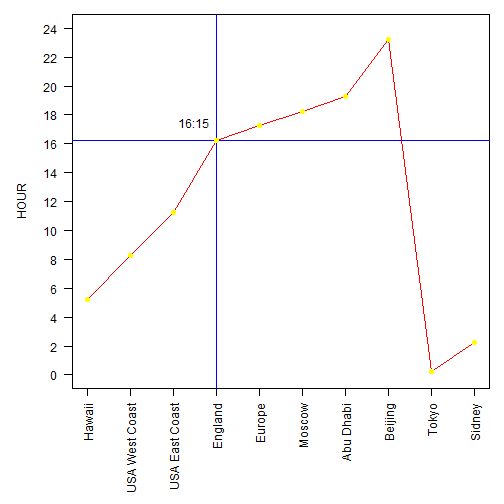

World Clock Shiny App
======
author: Iago Lopez
date: 23/10/2015

======

This app allows you to know what time is it in other parts of the world.

- Zone 1 - Sidney (Australia)
- Zone 2 - Tokyo (Japan)
- Zone 3 - Beijing (China)
- Zone 4 - Abu Dhabi (United Arab Emirates)
- Zone 5 - Moscow (Rusia)
- Zone 6 - Europe
- Zone 7 - England
- Zone 8 - East Coast (USA)
- Zone 9 - West Coast (USA)
- Zone 10 - Hawaii (USA)


======
You just have to input 3 things:
- Hour
- Minute
- Time zone

And it will give you what time it would be in the rest of the time zones with that information.

For example:
You are in England and it's 16:15, and you would like to know the time in the other time zones.


======
* The app gives you your local time first: 16:15

And after that, the rest of the time zones.
 
* Minutes don't change, so are not shown.


```
 [1] "Hawaii"         "USA West Coast" "USA East Coast" "England"       
 [5] "Europe"         "Moscow"         "Abu Dhabi"      "Beijing"       
 [9] "Tokyo"          "Sidney"        
```


Plotting world time-curve
======

When it's 16:15 in England

 

